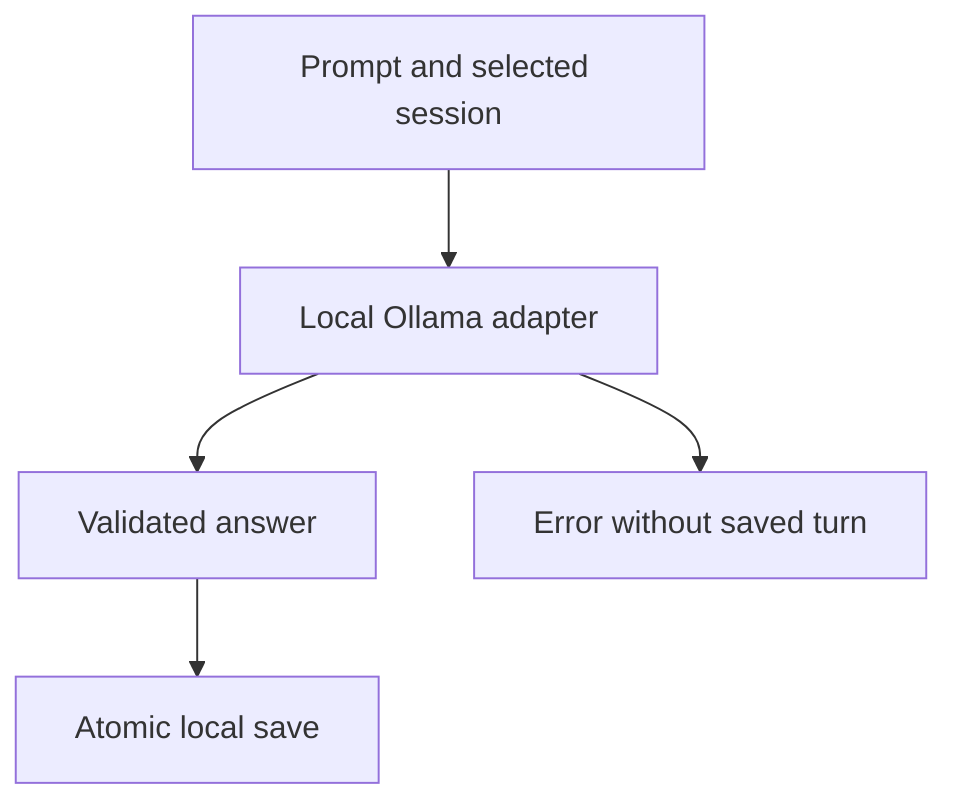

# System Design & Architecture

## Architecture Overview
Keep the assistant in a separate prometheus_assistant package. Do not couple model or memory failures to the Control Center.

## Data Models
SQLite sessions hold UUID, UTC creation time, and model name. Turns hold session ID, role, text, UTC creation time, and monotonically increasing row ID. Save user/assistant pairs in one transaction. Default database is the user's local application-data Prometheus directory, outside source control and source snapshots.

## API Design
Call only /api/tags and /api/chat on an HTTP loopback Ollama endpoint. Disable HTTP proxies and redirects. Require an installed local model and reject cloud tags/remote-model metadata. Use stream=false, context 2048, bounded output, bounded response size, and a finite timeout. Never execute a model-generated command.

## Component Breakdown
- prometheus.py: source-tree entrypoint.
- prometheus_assistant/ollama.py: local-only transport, input/response validation.
- prometheus_assistant/memory.py: local session persistence.
- prometheus_assistant/cli.py: chat, ask, doctor, sessions, and history.
- START_PROMETHEUS.cmd: normal-user Windows launcher.
- Existing prometheus_control_center remains unchanged.

## Design Decisions
Alternatives: raw Ollama CLI is quickest but does not provide Prometheus-owned durable history; a large UI/framework adds dependencies and RAM pressure; standard-library CLI plus SQLite is selected for a small, testable milestone. Memory remains conversation history, not automatic retraining or verified knowledge. Resume is explicit, not automatic across all chats.

## Non-Functional Requirements
No external model endpoint, cloud fallback, paid service, or account creation. Keep recent context bounded while retaining full local history. Errors do not fabricate or persist answers. The model can still hallucinate; research and safety-critical answers require verification. Record measured latency rather than promise high performance.
